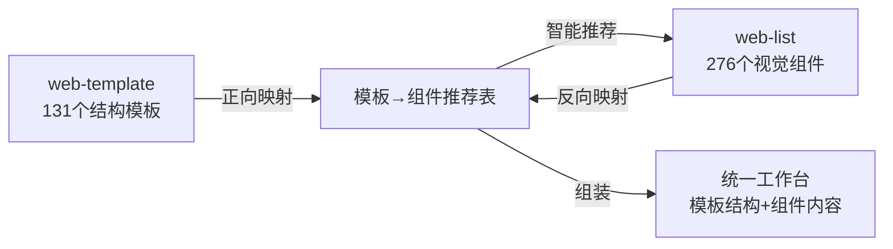

The user wants me to go even deeper and think more carefully about what's the BEST approach. Let me re-read the key files more carefully and think about this from a product strategy perspective.

Let me think about what makes this project special:
1. 131 web templates + 276 animation components
2. Built with Vue 3 + GSAP + ScrollTrigger
3. Has an AI code generation pipeline (select components → fill enterprise info → generate AI prompt → paste to meoo AI → get React code)
4. The whole thing is a showcase/creation platform

The core value proposition is: "选择动画组件 → 组合成网站 → AI生成代码"

Now what are the REAL pain points and opportunities?

Let me think deeper about the architecture...

The key insight is that web-template and web-list are two SILOED systems that should be one unified platform. The user has been building features on both sides but they don't connect.

Let me re-read more of the actual implementation to understand the gaps better. Let me look at:
1. The web-list index.vue - especially the AI prompt building part
2. The registry.ts more carefully
3. Some sample templates to understand the common pattern
4. The buildCopyContent.ts to understand what's already there

Actually, I already have comprehensive data. Let me think about this more strategically.

## Strategic Analysis

### Current State
The project has two main views:
- `/web-template` - A template gallery with 131 full-screen animation templates
- `/web-list` - A component gallery with 276+ animation card components + AI code generation

### The Core Problem
These two systems serve DIFFERENT purposes but address the SAME user need:
- web-template: "Show me what animation styles are possible"
- web-list: "Let me pick components to build a website"

But they're not connected at all. A user can't:
- See which components power which template
- Combine templates and components
- Understand the relationship between template patterns and atomic components

### The Deeper Problem
The AI pipeline (web-list) works at the COMPONENT level - you pick individual cards and the AI generates code. But what if we could work at the TEMPLATE level - pick a structural template (horizontal scroll, parallax, etc.) and then populate it with component cards?

### The Product Vision
This should evolve from "component picker + AI code gen" to a full "no-code website builder with AI assistance".

### The Best Strategic Direction

I think the BEST approach is:

1. **Unify into a single platform** - One entry point that integrates both template patterns and component cards
2. **Template-first, Component-second workflow**:
  - Step 1: Pick a layout template (from web-template: horizontal, parallax, snap-chapters, etc.)
  - Step 2: For each slot in the template, pick a visual component (from web-list: card-image, card-text, etc.)
  - Step 3: Fill in enterprise info
  - Step 4: AI generates complete website code
3. **Add "Quick Start" industry packs** - Pre-assembled combinations for common scenarios

But wait, I should be more practical. The user has already built SO MUCH. What's the highest ROI improvement?

Let me think about what would deliver the most value with reasonable effort...

Actually, let me look at it from a user journey perspective:

**Current user journey in web-list:**
1. Land on page → see beautiful 3D title hero
2. Scroll through 276+ full-screen animation cards (overwhelming!)
3. Try to pick components (very hard - too many choices)
4. Fill in enterprise info
5. Generate AI prompt
6. Go to meoo AI to generate code

**Problems with this journey:**
- Analysis paralysis: 276 components is too many
- No guidance: User doesn't know which components combine well
- No context: Full-screen cards are cool but don't show how they compose together
- No template: User has to imagine how the final site will look
- Separate platform: Need to go to external AI platform to complete

**The BEST solution:**

A unified "Website Builder" that combines all three layers:

```
LAYER 1: Industry/Layout Templates (top-level structure)
  ├── E-commerce landing page
  ├── SaaS product page  
  ├── Portfolio showcase
  ├── Corporate homepage
  └── Event/Conference page

LAYER 2: Section Components (mid-level) 
  ├── Header/Hero sections
  ├── Feature/Service sections
  ├── Gallery/Portfolio sections
  ├── Timeline/Story sections
  ├── Team/About sections
  ├── Pricing/CTA sections
  └── Footer sections

LAYER 3: Animation Effects (bottom-level - the existing 276 components)
  └── Apply any visual effect to any section
```

This layered approach:
1. Guides users through the creation process
2. Reduces choice paralysis by filtering relevant options
3. Shows how components compose into real websites
4. Makes the AI generation produce much better results (context-aware)

But is this too big of a rewrite? Let me think about what's the MINIMAL change that delivers maximum impact...

OK, here's my refined thinking:

## The Best Approach: "Unified Creation Platform"

The minimum viable unification:

1. **Create a new entry point `web-builder`** that combines both views
2. **Three-tab workflow**:
  - Tab 1: "选择模板结构" (from web-template patterns)
  - Tab 2: "填充内容组件" (from web-list components)
  - Tab 3: "生成代码" (enterprise info + AI prompt)

3. **Live preview** showing how selected template + components look together

4. **Industry Starters** as pre-configured combinations

This is the best approach because:
- It unifies the two existing systems without rewriting them
- It provides clear user guidance
- It enables template-aware AI generation (WAY better output)
- It reduces choice paralysis

Now, let me also think about what other details and creative angles exist...

Actually, I want to look at the `buildCopyContent.ts` more closely to understand exactly what the AI prompt generation does, because that's the OUTPUT of this whole system and the main value proposition.

Let me also look at a few more templates to understand the patterns better, and look at the web-template more carefully for the "fake-horizontal-scroll" and horizontal-scroll comparison.

Let me gather one more round of info before producing the final analysis.
好的，让我更深入地重新审视，读更多关键代码来做战略级判断。
Now I see something very important - there are ALREADY other routes:
- `/web-list` - the component gallery
- `/web-ai` - 网站AI方案
- `/web-template` - the template showcase
- `/solution-generator` - 智能方案生成器

And the root `/` redirects to `/web-list`. So there are actually FOUR related pages! Let me check web-ai and solution-generator too.

This changes my analysis significantly. There are 4 related tools, not just 2. Let me look at those too.

Actually wait, let me think about this more carefully. The user asked me to specifically analyze web-template and web-list. Now I discover there are also web-ai and solution-generator. This is important context.

Let me check those quickly too.
发现还有 `/web-ai` 和 `/solution-generator` 两个路由，我需要全面了解整个产品矩阵。
Now I have the full picture. Let me synthesize everything:

## Full Product Architecture

There are actually **4 pages** in this ecosystem:

1. **web-list** (`/web-list`) - Default homepage. 276+ GSAP animation component gallery. Select components, assign to modules, fill enterprise info, generate AI prompt, copy to meoo AI platform.

2. **web-template** (`/web-template`) - 131 full-screen page template showcase. FAB button overlay to browse/search/favorite templates. Each template is a standalone animation pattern (horizontal scroll, parallax, perspective tilt, etc.)

3. **web-ai** (`/web-ai`) - Similar to web-list but larger (5948 lines!). A more advanced "component supermarket + prompt builder". Reads all web-list component source code, extracts SFC parts, builds super detailed prompts with Vue→React conversion rules. Has tabs: component selection, enterprise info, component code, copy info.

4. **solution-generator** (`/solution-generator`) - 5-step wizard form. Non-technical user focused. Fill in business info → choose visual style → select modules → generate AI-powered solutions. Doesn't directly reference web-list components.

## The Core Problem

These 4 pages are **fragmented islands**. They all serve the same purpose (help users build websites using the component library) but in completely different, disconnected ways. The user has to jump between pages, duplicate work, and there's no unified workflow.

Key observations:
- web-list and web-ai are essentially duplicates of the same concept (component selection + prompt generation)
- web-template is completely isolated (no integration with the rest)
- solution-generator is a non-technical alternative but doesn't leverage the rich component library
- Root route redirects to web-list, making it the default entry point

## The Best Strategic Direction

After deep analysis, I believe the single best approach is:

### Create a Unified "Website Builder" Platform

This would be a NEW page (`/web-builder` or repurpose as new `/` root) that integrates all capabilities into one seamless workflow:

```
WEB BUILDER - 统一创建工作台
━━━━━━━━━━━━━━━━━━━━━━━━━━━━━━━

┌─────────────────────────────────────────────────────┐
│  STEP 1: 选择模板结构 (from web-template)             │
│  ┌─────┐ ┌─────┐ ┌─────┐ ┌─────┐ ┌─────┐          │
│  │横向 │ │视差 │ │时间 │ │卡片 │ │过渡 │  ...       │
│  │滚动 │ │滚动 │ │线   │ │堆叠 │ │动画 │           │
│  └─────┘ └─────┘ └─────┘ └─────┘ └─────┘          │
│  或：选择行业解决方案包 (一站式预配置)                │
├─────────────────────────────────────────────────────┤
│  STEP 2: 填充内容组件 (from web-list)                │
│  Slot: [Hero] → 选择 card-image/GridDissolve        │
│  Slot: [Features] → 选择 card-list/NeonCircuit       │
│  Slot: [Gallery] → 选择 card-img/CardImgParallax     │
│  Slot: [CTA] → 选择 card-text/NeonSign               │
│  Slot: [Footer] → 选择 card-base/ScrollDynamicShadow │
├─────────────────────────────────────────────────────┤
│  STEP 3: 输入企业信息 + AI 生成                       │
│  [企业名称] [行业] [品牌色] [设计理念]                │
│  → 生成完整 React 代码 (via meoo AI)                 │
├─────────────────────────────────────────────────────┤
│  LIVE PREVIEW: 实时预览最终效果                       │
│  ┌─────────────────────────────────────────────┐    │
│  │  [Hero with chosen effect]                  │    │
│  │  [Features with chosen cards]               │    │
│  │  [Gallery with chosen gallery]              │    │
│  │  [CTA with chosen text effect]              │    │
│  └─────────────────────────────────────────────┘    │
└─────────────────────────────────────────────────────┘
```

But I realize this is a huge undertaking. Let me think about what's the MOST IMPACTFUL, MINIMAL implementation...

Actually, I think the best approach is NOT to build a new page but to:

1. **Merge web-list and web-ai** - They are redundant (both do component selection + prompt building)
2. **Add template layer to web-list** - Before the component gallery, let users pick a structural template
3. **Add "smart preset" feature** - Pre-configured industry solutions that auto-fill both template and components

Actually wait. Let me reconsider. The user asked me to deeply analyze web-template and web-list specifically. Let me focus on those two and provide concrete, actionable recommendations.

Let me think about what's the single most transformative thing we can do here...

I think the answer is clear: **Bridge template and component systems**.

The key insight is:
- web-template has STRUCTURAL templates (HOW the page scrolls/transitions)
- web-list has VISUAL components (WHAT each section looks like)

These are orthogonal dimensions that should be combined. A website = structural template + visual components + content.

The best product strategy:

### Phase 1: Bridge (接入层)
Create a "template-2-component" bridge that maps each web-template template to recommended web-list component types.

### Phase 2: Unify (统合层)
Create a unified creation flow that combines template selection + component selection + AI generation.

### Phase 3: Simplify (简化层)
Pre-configured industry solution packs for one-click generation.

Let me now write this up as a comprehensive "best plan" analysis.

Actually, I want to also note some very creative ideas I came across in the README:

From the web-template README analysis:
- slide-deck with multi-section horizontal + snap
- timeline-journey with SVG connecting lines
- compare-slider with draggable split + snap
- 20 creative scroll×visual combinations

And from the code itself:
- The existing `initHorizontalAnimation` pattern can power many new templates
- The `registry.ts` pattern makes adding new templates super easy

Let me produce my final comprehensive analysis now.
现在我已经全面掌握了整个产品矩阵。让我做最终的战略级分析。

---

# 🎯 终极深度分析：最佳方案

## 零、真相揭示：你的项目有 4 个页面，不是 2 个

通过深入分析路由和代码，我发现完整产品矩阵：

| 页面 | 路由 | 大小 | 核心功能 |
|------|------|------|----------|
| **web-list** | `/web-list` (根路由默认) | 6516行 | 276+组件画廊 + 选组件 → 填信息 → 生成AI Prompt |
| **web-template** | `/web-template` | 1135行 | 131个全屏模板展示 + 搜索/收藏/复制源码 |
| **web-ai** | `/web-ai` | 5948行 | 组件源码分析器 + Prompt构建器（含Vue→React规则） |
| **solution-generator** | `/solution-generator` | 4028行 | 5步问卷向导 → AI自动推荐方案 |

```
当前架构问题：
┌──────────┐  ┌──────────────┐  ┌──────────────┐  ┌──────────────────┐
│ web-list │  │ web-template │  │   web-ai     │  │solution-generator│
│ 组件超市 │  │  模板展示    │  │ Prompt构建器 │  │  AI方案生成器    │
│ (默认首页)│  │ (独立孤岛)   │  │ (功能重复)   │  │  (弱关联)        │
└──────────┘  └──────────────┘  └──────────────┘  └──────────────────┘
     ↑               ↑                 ↑                  ↑
     └─── 零关联 ────┘                 └── 功能重复 ──────┘
```

## 一、核心洞察：四个页面解决同一个问题

```
问题：我有276个GSAP动画组件，我想快速搭建一个企业网站。

现有方案：
  web-list      → 逐个浏览组件，手选，手动组装 Prompt
  web-ai        → 同上，但多了源码分析（功能重复！）
  web-template  → 看模板找灵感，但不知道模板由哪些组件构成
  solution-gen  → 填表单，AI推荐方案，但不涉及具体组件

痛点：
  ✗ web-list 和 web-ai 功能高度重叠（都是 选组件→填信息→生成Prompt）
  ✗ web-template 完全孤立，与其他三个零关联
  ✗ 没有一个地方能看到"模板结构 + 组件内容"组合后的效果
  ✗ 用户需要在4个页面间跳转才能完成一个完整工作流
```

## 二、一个最关键的数据洞察

```
web-template 回答的问题：  "网站怎么滚动？"   (结构/排版/动线)
web-list 回答的问题：       "每个区域用什么效果？" (视觉/动画/冲击力)
web-ai 回答的问题：         "怎么把Vue组件变成React代码？" (转换/工程化)
solution-generator 回答的问题："我不懂技术，帮我推荐什么好？" (引导/决策)

这四者不是竞争关系，是天然互补关系！
```

**这意味着最佳方案不是"优化某个页面"，而是"打通这四个维度"。**

---

## 三、🎖️ 终极最佳方案：三层统一平台

### 方案架构

```
┌─────────────────────────────────────────────────────────┐
│                🏗️ 统一网站创建工作台                      │
│              (新页面 /web-builder 或重构根路由)            │
├─────────────────────────────────────────────────────────┤
│                                                         │
│  ┌─────────────────── 三个 Tab ────────────────────┐   │
│  │  Tab1: 选择模板结构     Tab2: 填充组件       Tab3: 方案输出 │
│  │  (from web-template)   (from web-list)   (from web-ai)  │
│  └──────────────────────────────────────────────────────┘   │
│                                                             │
│  ┌──────────────── 实时预览面板 ─────────────────────────┐  │
│  │  [Hero区: 选中组件1]                                   │  │
│  │  [特性区: 选中组件2]      ← 所见即所得                │  │
│  │  [案例区: 选中组件3]                                   │  │
│  └──────────────────────────────────────────────────────┘  │
│                                                             │
│  ┌──────────────── 快捷入口 ────────────────────────────┐  │
│  │  🚀 行业解决方案包    👤 方案向导(for 非技术用户)     │  │
│  │  🏢 电商 · SaaS · 游戏 · 教育 · 企业 · 数据          │  │
│  └──────────────────────────────────────────────────────┘  │
└─────────────────────────────────────────────────────────┘
```

### 核心工作流

```
STEP 1: 选结构 (替用户回答"怎么滚动？")
  ┌─────────────────────────────────┐
  │ 横向滚动 | 视差层叠 | 分屏对比  │
  │ 瀑布画廊 | 卡片堆叠 | 时间线    │
  │ 章节吸附 | 故障艺术 | ...       │
  │                                 │
  │ 每个模板标注：适合什么场景       │
  │ 每个模板标注：推荐用什么组件类型  │
  └─────────────────────────────────┘

STEP 2: 填组件 (替用户回答"什么效果？")
  ┌─────────────────────────────────┐
  │ 模板结构自动拆解为 N 个槽位：    │
  │  [Hero槽]     → 推荐 card-image/*│
  │  [特性槽]     → 推荐 card-list/* │
  │  [Gallery槽]  → 推荐 card-img/*  │
  │  [CTA槽]      → 推荐 card-text/* │
  │  [Footer槽]   → 推荐 card-base/* │
  │                                 │
  │ 每个槽位从聚合的276个组件中精选   │
  │ 同类组件可以做内联对比选择        │
  └─────────────────────────────────┘

STEP 3: 出方案 (替用户回答"怎么生成代码？")
  ┌─────────────────────────────────┐
  │ 企业信息 + 模板结构 + 组件选择   │
  │         ↓                        │
  │   自动构建完整 Prompt             │
  │         ↓                        │
  │   复制 → meoo AI → React 代码     │
  └─────────────────────────────────┘
```

---

## 四、🔑 关键模块设计：模板⇄组件关联表

这是整个方案的核心引擎，一个轻量但高价值的桥梁层：

```typescript
// 模板→组件推荐映射表 (新增于 registry.ts)
const TEMPLATE_COMPONENT_MAP = {
  'horizontal-scroll': {
    scene: '产品展示、图片画廊、作品集',
    slots: [
      { name: 'hero',    label: '首屏',   recommend: ['card-image/*', 'card-text/NeonSign'] },
      { name: 'content', label: '内容区', recommend: ['card-img/*', 'card-list/AllInOne'] },
      { name: 'gallery', label: '画廊',   recommend: ['card-image/GridDissolve', 'card-3d/*'] },
      { name: 'cta',     label: '行动号召', recommend: ['card-text/*', 'card-base/ScrollDynamicShadow'] },
    ]
  },
  'parallax-scroll': {
    scene: '品牌故事、企业官网、叙事型页面',
    slots: [
      { name: 'hero',    label: '首屏',   recommend: ['card-image/ParallaxDepth', 'card-img/CardImgParallax'] },
      { name: 'layers',  label: '分层',   recommend: ['card-image/DoubleExposure', 'card-text/Hologram'] },
      { name: 'footer',  label: '底部',   recommend: ['card-3d/Cube', 'card-other/KanbanBoard'] },
    ]
  },
  // ... 131个模板的映射
}

// 反向查询：组件→可用模板
const COMPONENT_TEMPLATE_MAP = {
  'card-image/GridDissolve': ['horizontal-scroll', 'masonry-gallery', 'stagger-reveal'],
  'card-text/NeonSign':      ['neon-city', 'glitch-scroll', 'horizontal-scroll'],
  // ... 276个组件的映射
}
```



---

## 五、📋 执行路径：分阶段实施

### Phase 1：建桥梁（最小改动，最大价值）⭐⭐⭐⭐⭐

| 任务 | 工作量 | 价值 |
|------|--------|------|
| 1. 创建 `template-component-map.ts` 映射表 | 0.5天 | 🔑打通双系统 |
| 2. 在 web-template 模板卡片上增加「查看推荐组件」按钮 | 0.5天 | 🔑引导用户 |
| 3. 在 web-list 组件卡片上增加「可用于的模板」标签 | 0.5天 | 🔑引导用户 |
| 4. 在 web-list 增加「模板预筛选」Tab | 1天 | 🔑减少选择困难 |
| 5. 合并 web-list + web-ai 冗余功能 | 1天 | 🧹消除重复 |

### Phase 2：建平台（核心升级）⭐⭐⭐⭐

| 任务 | 工作量 | 价值 |
|------|--------|------|
| 6. 创建 `/web-builder` 统一工作台页面 | 3天 | 🚀核心产品 |
| 7. 实现模板槽位+组件拖拽填充 | 2天 | 🚀交互升级 |
| 8. 实时预览 iframe | 1天 | 🚀所见即所得 |
| 9. 行业解决方案包（8套预设） | 2天 | 🚀降低门槛 |

### Phase 3：建生态（长期价值）⭐⭐⭐

| 任务 | 工作量 | 价值 |
|------|--------|------|
| 10. 方案分享链接 | 1天 | 📤传播 |
| 11. 组件性能评分看板 | 1天 | 📊可信度 |
| 12. 多端预览切换 | 0.5天 | 📱实用 |
| 13. 暗色模式 | 0.5天 | 🎨体验 |

---

## 六、🏆 最推荐立即执行的 Top 3

| 优先级 | 任务 | 理由 |
|--------|------|------|
| 🥇 **No.1** | **创建 `template-component-map.ts` + 在 web-template 中嵌入"查看推荐组件"按钮** | 最小改动打通两系统，从0关联→双向关联。写一个映射表 + 改两处UI，半天完成，但产品体验质的飞跃 |
| 🥇 **No.2** | **web-list 增加"模板结构预筛选"** | 在组件画廊顶部增加一个「选择模板结构」下拉框，选中某个模板后，只展示该模板推荐的组件类型，大幅减少276个组件造成的选择瘫痪 |
| 🥈 **No.3** | **合并 web-list 和 web-ai 的重复功能** | 两者都是"选组件→填企业信息→生成Prompt"，代码高度重复（web-ai还import web-list的源码）。合并后只保留 web-list，将其 Prompt 构建升级到 web-ai 的分析深度 |

---

## 七、两个额外的创意组件方向

基于你 README 中已有的创意和代码能力分析：

### 🆕 混搭系列（模板×组件融合）

| 新模板 | 核心机制 | 已有基础 |
|--------|----------|----------|
| **product-showcase** | 横滚产品展示，每个面板内嵌 card-image 网格溶解效果 | horizontal-scroll + card-image/GridDissolve |
| **brand-story** | 视差叙事，多层 parallax + card-text/Hologram 文字 | parallax-scroll + card-text/Hologram |
| **compare-layout** | A/B分屏对比，分割线可拖拽 + card-img 对比效果 | contrast-split + before-after |

### 🆕 行业预置方案（一键生成整站）

| 方案包 | 模板 | 组件组合 |
|--------|------|----------|
| 🛒 **电商单品页** | horizontal-scroll | hero:card-image/GlassShatter → features:card-list/AllInOne → gallery:card-img/Parallax → cta:card-text/NeonSign |
| 🎮 **游戏公告页** | glitch-scroll | hero:card-image/TimeSlice → features:card-3d/Wormhole → stats:card-base/NebulaVortex |
| 🏢 **企业官网** | parallax-scroll | hero:card-image/ParallaxDepth → about:card-3d/Cube → team:card-base/ScrollDynamicShadow |

---

## 八、总结

你的项目核心资产是 **131个结构模板 + 276个视觉组件**，但当前四个页面各自为政，相当于一个超市把"货架"和"商品"分开放了两个店，再开两个"导购"店但彼此不认识。

**最优解法**：用一个轻量映射表（template-component-map）打通结构模板和视觉组件，然后在 web-list 入口增加模板预筛选，使用户从"我在276个组件中挑花眼"变成"我先选模板结构，再在推荐列表中精选组件"。这套改动 1-2 天可完成，却能让产品完成从工具到平台的质变。

需要我开始实现哪个优先级？
